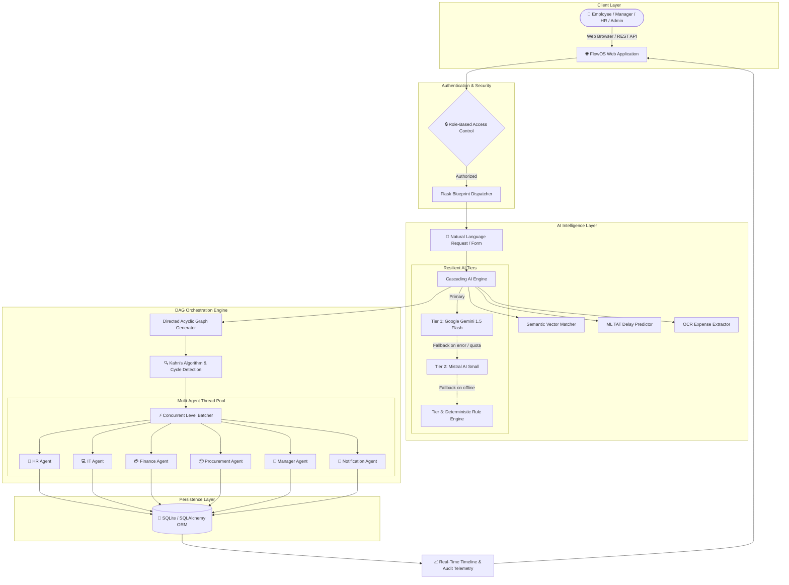

# ⚡ FlowOS — AI-Powered Enterprise Workflow Operating System

<div align="center">

[](https://www.python.org/)
[](https://flask.palletsprojects.com/)
[](https://www.sqlalchemy.org/)
[](https://ai.google.dev/)
[](https://mistral.ai/)
[](https://scikit-learn.org/)
[](https://pytest.org/)
[](LICENSE)

**Intelligent Enterprise Process Automation powered by Multi-Agent DAG Orchestration & Resilient LLMs.**

[Live Repository](https://github.com/dhanyagowda655/OSflow-.git) • [Report Issue](https://github.com/dhanyagowda655/OSflow-/issues) • [Request Feature](https://github.com/dhanyagowda655/OSflow-/issues)

</div>

---

## 📑 Table of Contents

- [📌 Overview](#-overview)
- [🌟 Key Architectural Highlights](#-key-architectural-highlights)
- [🏗️ System Architecture & Dataflow](#️-system-architecture--dataflow)
- [🧠 3-Tier Resilient AI Cascade Engine](#-3-tier-resilient-ai-cascade-engine)
- [⚡ Multi-Agent DAG Orchestrator (Kahn's Algorithm)](#-multi-agent-dag-orchestrator-kahns-algorithm)
- [👥 7 Pre-Configured Enterprise Roles (RBAC)](#-7-pre-configured-enterprise-roles-rbac)
- [🤖 Specialized Department Agents](#-specialized-department-agents)
- [📊 ML Delay Prediction & OCR Pipeline](#-ml-delay-prediction--ocr-pipeline)
- [🚀 Quickstart & Installation Guide](#-quickstart--installation-guide)
- [🔑 Environment Variables Reference](#-environment-variables-reference)
- [📁 Project Directory Structure](#-project-directory-structure)
- [🧪 Running Automated Tests](#-running-automated-tests)
- [🤝 Contributing](#-contributing)
- [📄 License](#-license)

---

## 📌 Overview

**FlowOS** is a full-stack, enterprise-grade workflow orchestration platform designed for modern engineering and operations organizations. It replaces disjointed ticketing queues with an intelligent, self-service operating portal.

Employees and managers can submit requests through **natural language prompts** (e.g. *"Onboard John Doe as a Senior Backend Engineer: verify credentials, provision MacBook Pro, configure GitHub access, assign IT buddy, and schedule payroll"*) or standard **one-click workflows** (Leave Approvals, Hardware Provisioning, Expense Reimbursements, and IT Support Triage).

Behind the scenes, FlowOS compiles requests into **Directed Acyclic Graphs (DAGs)**, topologically sorts task dependencies, and dispatches tasks concurrently across simulated, domain-specific departmental agents with automatic error recovery, retries, and human-in-the-loop approvals.

---

## 🌟 Key Architectural Highlights

- 🛡️ **Zero-Crash Resilient AI Engine**: 3-tier cascade fallback (`Gemini 1.5 Flash` &rarr; `Mistral AI Small` &rarr; `Deterministic Rule-based Generator`) guarantees uninterrupted execution even with missing API keys, rate limits, or network downtime.
- ⚡ **Concurrent DAG Multi-Agent Dispatcher**: Kahn’s algorithm sorts dependencies into level-based execution batches executed concurrently via Python's `ThreadPoolExecutor`.
- 🔄 **Self-Healing & Exponential Backoff**: Automatic retry policy (`wait = min(2**attempt, 8)`) with branch isolation ensuring independent DAG paths continue executing even if a single branch hits a transient failure.
- 🔐 **Strict Role-Based Access Control (RBAC)**: Custom `@roles_required` decorator enforcing multi-department separation across 7 enterprise personas.
- 📈 **Machine Learning Turnaround Time (TAT) Predictor**: Scikit-learn `GradientBoostingRegressor` model trained on historical task volumes to estimate workflow completion time and highlight potential delay risks.
- 🧾 **OCR Receipt & Document Parser**: Regex-powered text extraction pipeline for expense receipts, calculating total amounts, vendors, and dates while flagging duplicate claims.
- 📊 **Real-Time Telemetry & Live Polling Timeline**: Live-updating workflow timeline with Chart.js analytics dashboards and AI prompt/response audit logs.

---

## 🏗️ System Architecture & Dataflow



---

## 🧠 3-Tier Resilient AI Cascade Engine

FlowOS is engineered to **never crash** due to external AI provider outages or quota depletion:

```
┌────────────────────────────────────────────────────────┐
│             Natural Language Workflow Prompt           │
└──────────────────────────┬─────────────────────────────┘
                           │
                           ▼
          ┌──────────────────────────────────┐
          │  Tier 1: Google Gemini 1.5 Flash │  ◄── Primary high-speed LLM
          └────────────────┬─────────────────┘
                           │ (On RateLimit / API Key missing / Exception)
                           ▼
          ┌──────────────────────────────────┐
          │   Tier 2: Mistral AI (Small)     │  ◄── Robust secondary LLM
          └────────────────┬─────────────────┘
                           │ (On Failure / Offline)
                           ▼
          ┌──────────────────────────────────┐
          │ Tier 3: Deterministic Generator  │  ◄── 100% offline rule engine
          └──────────────────────────────────┘
```

1. **Tier 1 (Gemini 1.5 Flash)**: High-speed structured JSON generation and ticket classification.
2. **Tier 2 (Mistral Small)**: Direct API fallback if Google Gemini hits rate limits or connection errors.
3. **Tier 3 (Deterministic Engine)**: Built-in keyword extraction, template matching, and dependency graph synthesis that functions **with zero internet connection or API keys**.

---

## ⚡ Multi-Agent DAG Orchestrator (Kahn's Algorithm)

Complex enterprise workflows cannot execute in a naive linear sequence. FlowOS structures every workflow as a Directed Acyclic Graph (DAG):

1. **Cycle Detection & Topological Sorting**: Implements Kahn's Algorithm to compute task in-degrees and prevent deadlocks or circular dependencies.
2. **Level-Batch Concurrency**: Tasks with identical dependency depths are batched together and executed concurrently across threads.
3. **Branch Failure Isolation**: If a non-blocking branch fails, remaining independent parallel branches proceed without termination.

```
       [Start: Verify Employee Info (HR)]
                     │
         ┌───────────┴───────────┐
         ▼                       ▼
 [Create Email (IT)]    [Provision Laptop (IT)]
         │                       │
         ▼                       ▼
 [GitHub Access (IT)]   [Courier Dispatch (Procurement)]
         └───────────┬───────────┘
                     ▼
        [Schedule Orientation (HR)]
                     │
                     ▼
       [Enroll in Payroll (Finance)]
```

---

## 👥 7 Pre-Configured Enterprise Roles (RBAC)

FlowOS comes pre-seeded with 7 standard enterprise personas. All demo accounts share the password **`Demo@123`** *(1-click autofill available on the login page)*:

| Role | Demo Email | Password | Primary Capabilities & Modules |
|:---|:---|:---|:---|
| **Employee** | `employee@flowos.demo` | `Demo@123` | Natural language workflow generator, leave applications, laptop requests, IT ticket portal, expense claims, live task tracker. |
| **Manager** | `manager@flowos.demo` | `Demo@123` | Human-in-the-loop approval inbox, team member roster, budget authorization, direct report requests stream. |
| **HR Specialist** | `hr@flowos.demo` | `Demo@123` | 7-step employee onboarding wizard, employee directory, leave balance management, organizational workflow studio. |
| **IT Support** | `it@flowos.demo` | `Demo@123` | AI ticket triage desk, hardware asset fleet registry, software license provisioning, resolution tracking. |
| **Finance Officer** | `finance@flowos.demo` | `Demo@123` | Expense OCR claim auditing, duplicate receipt detection, reimbursement payout approvals, financial ledger logs. |
| **Procurement** | `procurement@flowos.demo` | `Demo@123` | Purchase order (PO) generation, hardware asset fulfillment, vendor dispatch, inventory replenishment. |
| **Administrator** | `admin@flowos.demo` | `Demo@123` | Global user & department administration, AI query audit trail, live AI health latency monitor, ML model analytics. |

---

## 🤖 Specialized Department Agents

FlowOS includes modular, simulated departmental agents that execute discrete task steps:

| Agent | Module | Primary Responsibilities |
|---|---|---|
| **HR Agent** | `agents/hr_agent.py` | Document verification, employee directory creation, leave balance adjustment, onboarding scheduling. |
| **IT Agent** | `agents/it_agent.py` | Email creation, cloud/GitHub provisioning, hardware allocation, automated ticket resolution. |
| **Finance Agent** | `agents/finance_agent.py` | Payroll enrollment, expense validation, OCR amount matching, payment approval processing. |
| **Procurement Agent** | `agents/procurement_agent.py` | PO creation, stock availability check, hardware courier tracking, vendor fulfillment. |
| **Manager Agent** | `agents/manager_agent.py` | Departmental budget checking, leave impact assessment, manager approval routing. |
| **Notification Agent** | `agents/notification_agent.py` | Cross-department email/Slack-style alerts, employee notifications, status broadcasts. |

---

## 📊 ML Delay Prediction & OCR Pipeline

### 1. Turnaround Time (TAT) Predictor (`ai/delay_predictor.py`)
- **Model**: `scikit-learn` `GradientBoostingRegressor`
- **Features**: Task count, department complexity weight, historical queue depth, and agent type mix.
- **Output**: Estimated completion turnaround time (in hours) and a Boolean **Delay Risk Indicator** (`High Risk` vs. `On Track`).

### 2. Intelligent Expense OCR Parser (`ai/ocr.py`)
- Automated text extraction from receipt images and documents.
- Regex pattern matching for **Amount Currency**, **Merchant / Vendor**, and **Invoice Date**.
- Automated hash checks to alert finance officers of duplicate expense submissions.

---

## 🚀 Quickstart & Installation Guide

### Prerequisites
- **Python 3.10+** (Tested on Python 3.10, 3.11, 3.12, and 3.13)
- **Git**

---

### Step 1: Clone the Repository
```bash
git clone https://github.com/dhanyagowda655/OSflow-.git
cd OSflow-
```

### Step 2: Create & Activate Virtual Environment

**On Windows (PowerShell):**
```powershell
python -m venv venv
.\venv\Scripts\Activate.ps1
```

**On macOS / Linux:**
```bash
python3 -m venv venv
source venv/bin/activate
```

### Step 3: Install Dependencies
```bash
pip install --upgrade pip
pip install -r requirements.txt
```

### Step 4: Configure Environment Variables
Copy `.env.example` to create your local `.env`:

**Windows (PowerShell):**
```powershell
Copy-Item .env.example .env
```

**macOS / Linux:**
```bash
cp .env.example .env
```

*(Optional: Add your `GEMINI_API_KEY` or `MISTRAL_API_KEY` into `.env`. If left empty, FlowOS will automatically use the built-in deterministic rule engine with 100% functionality!)*

### Step 5: Initialize & Seed Database
```bash
python seed.py
```
*This populates the SQLite database (`flowos.db`) with demo users for all 7 roles, sample workflows, hardware inventory, and AI telemetry logs.*

### Step 6: Start the Application
```bash
python app.py
```
Open your browser and navigate to **`http://127.0.0.1:5000`**.

---

## 🔑 Environment Variables Reference

| Variable | Required | Default | Description |
|---|---|---|---|
| `FLASK_SECRET_KEY` | Yes | `dev-flowos-super-secret-key` | Session encryption and CSRF protection key. |
| `DATABASE_URL` | No | `sqlite:///flowos.db` | SQLAlchemy database URI. |
| `GEMINI_API_KEY` | Optional | `""` | Google Gemini API key for Tier 1 LLM generation. |
| `MISTRAL_API_KEY` | Optional | `""` | Mistral AI API key for Tier 2 LLM fallback. |
| `MAIL_SERVER` | Optional | `smtp.gmail.com` | SMTP email server host. |
| `MAIL_PORT` | Optional | `587` | SMTP email server port. |
| `MAIL_USERNAME` | Optional | `""` | SMTP sender email username. |
| `MAIL_APP_PASSWORD` | Optional | `""` | SMTP application password. |
| `MAIL_ENABLED` | Optional | `false` | Enable/disable live external email sending. |

---

## 📁 Project Directory Structure

```
FlowOSCOde/
├── agents/                         # Multi-Agent subsystem
│   ├── __init__.py
│   ├── base.py                     # Base Agent class with retry & error logging
│   ├── hr_agent.py                 # HR department task execution
│   ├── it_agent.py                 # IT provisioning & triage execution
│   ├── finance_agent.py            # Expense & payroll task execution
│   ├── procurement_agent.py        # Hardware PO & shipping execution
│   ├── manager_agent.py            # Approval routing execution
│   ├── notification_agent.py       # Alert & message dispatching
│   └── orchestrator.py             # Topological DAG Kahn's algorithm & thread dispatcher
├── ai/                             # Resilient AI subsystem
│   ├── __init__.py
│   ├── ai_client.py                # 3-tier cascade engine (Gemini -> Mistral -> Fallback)
│   ├── delay_predictor.py          # Scikit-learn turnaround time predictor
│   ├── embeddings.py               # Vector similarity template matcher
│   ├── ocr.py                      # Receipt OCR regex parser
│   ├── prompts.py                  # Structured LLM prompt definitions
│   └── workflow_generator.py       # Natural language DAG compiler
├── blueprints/                     # Modular domain routing
│   ├── admin/                      # Admin analytics, user & AI audit logs
│   ├── api/                        # REST API endpoints & telemetry polling
│   ├── auth/                       # Login, registration & session handling
│   ├── employee/                   # Employee self-service request forms
│   ├── finance/                    # Expense claims & receipt validation
│   ├── hr/                         # Employee directory & onboarding wizard
│   ├── it/                         # Asset fleet tracker & ticket triage desk
│   ├── manager/                    # Human-in-the-loop approvals queue
│   ├── procurement/                # PO order fulfillment & tracking
│   └── workflow/                   # Natural language workflow builder & viewer
├── static/                         # UI static assets
│   ├── css/custom.css              # FlowOS design system & dark glassmorphic styling
│   └── js/main.js                  # Polling engine, Chart.js telemetry, & interactive forms
├── templates/                      # Jinja2 HTML templates organized by domain
│   ├── admin/                      # Dashboard, audit, users, analytics templates
│   ├── auth/                       # Login & registration views
│   ├── employee/                   # Employee portal & request forms
│   ├── finance/                    # Expense auditing views
│   ├── hr/                         # Onboarding & leave management views
│   ├── it/                         # Ticket triage & hardware fleet views
│   ├── manager/                    # Approval queue views
│   ├── procurement/                # PO tracking views
│   ├── workflow/                   # DAG visualizer & workflow builder views
│   └── base.html                   # Master layout with responsive navigation
├── tests/                          # Automated Pytest test suite
│   ├── test_auth.py                # RBAC & authentication unit tests
│   ├── test_laptop_flow.py         # Hardware procurement end-to-end integration test
│   ├── test_leave_flow.py          # Leave request approval/rejection test
│   └── test_workflow_generator.py  # DAG sorting, cycle detection & AI fallback tests
├── .env.example                    # Environment variable template
├── .gitignore                      # Git ignore rules for Python, SQLite, & IDEs
├── app.py                          # Flask application factory & server startup
├── config.py                       # Configuration loader
├── extensions.py                   # SQLAlchemy, LoginManager & CSRF instances
├── LICENSE                         # MIT License
├── models.py                       # Database models & relationships
├── README.md                       # Comprehensive documentation
├── requirements.txt                # Python package requirements
└── seed.py                         # Mock database seeder
```

---

## 🧪 Running Automated Tests

FlowOS includes a comprehensive test suite using `pytest` covering role authentication, access control boundaries, hardware provisioning lifecycle chains, leave workflows, Kahn's algorithm DAG sorting, and AI fallback resilience.

Run all tests with verbose output:
```bash
pytest -v
```

### Test Suite Summary:
- ✅ `test_auth.py::test_login_all_7_roles`: Validates login and authentication for all 7 personas.
- ✅ `test_auth.py::test_role_based_access_control`: Enforces strict 403 Forbidden redirects for unauthorized routes.
- ✅ `test_auth.py::test_landing_page`: Confirms guest landing page and navigation links.
- ✅ `test_laptop_flow.py::test_laptop_provisioning_full_chain`: Full integration test of employee request &rarr; manager approval &rarr; IT provisioning &rarr; procurement PO dispatch.
- ✅ `test_leave_flow.py::test_leave_flow_approval_path`: Validates leave submission, balance deduction, and approval.
- ✅ `test_leave_flow.py::test_leave_flow_rejection_path`: Validates leave denial and manager feedback.
- ✅ `test_workflow_generator.py::test_dag_topological_sort_and_parallel_batches`: Verifies Kahn's algorithm ordering and concurrent batching.
- ✅ `test_workflow_generator.py::test_dag_cycle_detection_error`: Validates detection and prevention of cyclic workflows.
- ✅ `test_workflow_generator.py::test_ai_workflow_generation_resilient_fallbacks`: Validates fallback generation without external API dependencies.
- ✅ `test_workflow_generator.py::test_ticket_classification_fallback`: Tests NLP ticket category classification.

---

## 🤝 Contributing

Contributions, issues, and feature requests are welcome!

1. Fork the repository (`https://github.com/dhanyagowda655/OSflow-.git`)
2. Create your Feature Branch (`git checkout -b feature/AmazingFeature`)
3. Commit your Changes (`git commit -m 'Add some AmazingFeature'`)
4. Push to the Branch (`git push origin feature/AmazingFeature`)
5. Open a Pull Request

---

## 📄 License

Distributed under the **MIT License**. See [`LICENSE`](LICENSE) for more information.

---

<div align="center">

**Built with ❤️ for modern agile enterprises.**

</div>